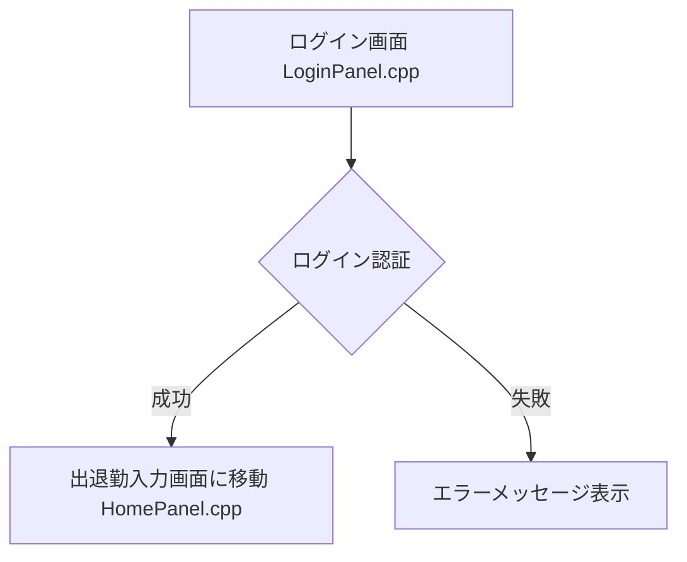
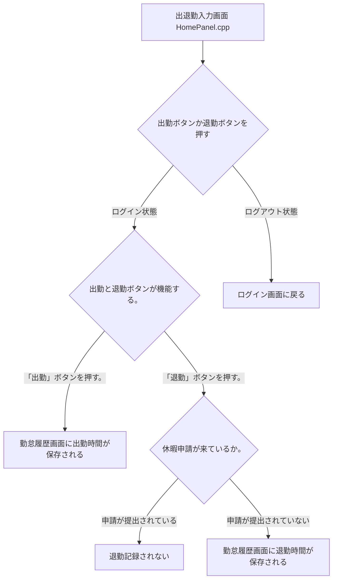

# 勤怠管理システム
## 概要

C++のGUIシステム理解の為に色々な機能を確かめ、行えるシステムを作成するため、自身なりの勤怠管理システムを作成。

```text
言語 C++

GUIライブラリ wxWidgets

データベース PostgreSQL

DB管理ツール pgAdmin4

開発環境 VsCode/ Git Bash(MSYS2/UCRT64)
```

## 主な機能

### ログイン機能



### 出退勤入力機能



### 勤怠履歴機能

#### 勤怠履歴表(HistoryPanel.cpp)
| ユーザー | 出勤 | 退勤 | 修正メッセージ | 休暇メッセージ | 残業メッセージ |
| :--- | :--- | :--- | :--- | :--- | :--- | 
| ユーザー名 | 出勤時間 | 退勤時間 | 修正理由 | 休暇理由 | 残業理由 |
